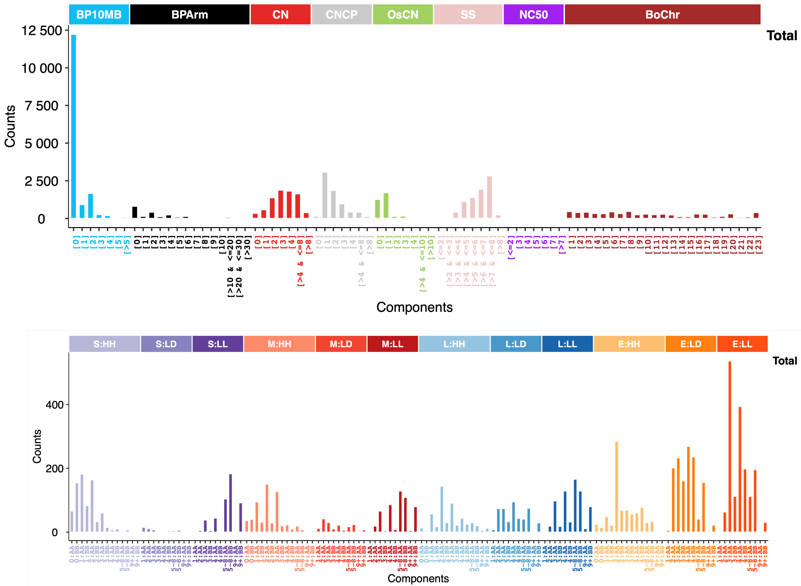

To develop a stable, effective, and cost-efficient predictive biomarker for oxaliplatin-based chemotherapy response in metastatic colorectal cancer patients, we utilized shallow whole-genome sequencing(sWGS) data to extract copy number alteration(CNA) features. These features, combined with clinical characteristics, were used to construct a machine learning model, ultimately resulting in the development of a highly predictive model known as the CNA fingerprint.

## 1.1 Raw data processing

Suppose "i" is the sample name. Using follow tools:

### fastp

Quality control.

```{bash,eval=FALSE}
fastp -i $workdir/$fq1 -I $workdir/$fq2 \
-o ${i}_fp_1.fq.gz -O  ${i}_fp_2.fq.gz 
-h ${i}_fastp.html \
-w 10
```

### BWA MEM
Mapping.

```{bash,eval=FALSE}
bwa mem -M -R "@RG\tID:$i\tLM:$i\tSM:$i\tPL:illumina\tPU:$i" 
-t 8 \
/path_to_hg38_genome/GRCh38.d1.vd1.fa \
$workdir/${i}_fp_1.fq.gz \
$workdir/${i}_fp_2.fq.gz > $workdir/${i}.sam
```

### Samtools
Transform sam to bam file.

```{bash,eval=FALSE}
samtools view -@ 8 -bS $workdir/${i}.sam > $workdir/${i}_unsort.bam
```

### Picard
Sort the bam file.

```{bash,eval=FALSE}
java -jar -Xmx12G -Djava.io.tmpdir=/path_to_tmp/tmp \
/path_to_picard-2.20.6-0/picard.jar SortSam \
I=$workdir/${i}_unsort.bam \
O=$workdir/${i}_sorted.bam \
SORT_ORDER=coordinate
```

## 1.2 CNA features calling
Suppose you have got your bam file. Using follow tools:

### QDNAseq
CBC segment,the defult genome is hg19,here we use hg38,and binsize as 100.

```{r,eval=FALSE}
library(QDNAseq)
library(QDNAseq.hg38)
library(stringr)
library(ACE)
library(DNAcopy)

args <- commandArgs(trailingOnly = TRUE)
#args 1，sample name
#args 2，path to bam
#args 3，the output path

i <- args[1]
s <- paste0(i,"_sorted.bam")
#binsize: 100
bins <- getBinAnnotations(binSize=100,genome="hg38")
readCounts <- binReadCounts(bins,bamfile=paste0(args[2],"/",s))
readCountsFiltered <- applyFilters(readCounts,residual=TRUE, blacklist=TRUE)
readCountsFiltered <- estimateCorrection(readCountsFiltered)
copyNumbers <- correctBins(readCountsFiltered)
copyNumbersNormalized <- normalizeBins(copyNumbers)
copyNumbersSmooth <- smoothOutlierBins(copyNumbersNormalized)
copyNumbersSegmented <- segmentBins(copyNumbersSmooth, transformFun="log2")
copyNumbersSegmented <- normalizeSegmentedBins(copyNumbersSegmented)

save(copyNumbersSegmented,file="/your_path/copyNumbersSegmented.rda")

```

you can run like:
```{bash,eval=FALSE}
Rscript QDNAseq.R $sampleid $path/yourbamfile $outdir
```


### ACE
Fit the cellularity and ploidy

```{bash,eval=FALSE}
sqm <- squaremodel(copyNumbersSegmented, QDNAseqobjectsample = 1, 
                   penalty = 0.65, penploidy = 0.65, 
                   ptop = 5.3, pbottom = 1.8, prows = 250,
                   cellularities = seq(50, 100, length.out = 50),
                   sgc = c("X", "Y"),exclude=c())

# Here we get the purity ploidy and error values of all the fits, referring to the official ACE document that states “the minimum error is not necessarily the best fit”, it is recommended to select combinations with higher cellular purity in the similar minimum error set, and at the same time select combinations with higher ploidy based on the a priori knowledge of the genomes of colon cancer.

mdf <- sqm$minimadf
mdf <- mdf[order(mdf$error,-mdf$cellularity),]

# Manual screening and determination ploidy and cellularity,for example:

ploidy = 7.6
cellularity = 0.8


# Absoult CNA calling
m<-ACEcall(copyNumbersSegmented, QDNAseqobjectsample = TRUE, scellularity = cellularity,
           ploidy = ploidy, standard =1, plot = FALSE,
           qcutoff = -3, subcutoff = 0.2, trncname = FALSE,
           cap = 12, bottom = 0, 
           onlyautosomes = TRUE
           )

segment <- data.frame(copyNumbersSegmented@featureData@data[1:nrow(m),1:3],segment_mean=m$segment_mean)
segment <- na.omit(segment)
segment$segment_mean <- round(segment$segment_mean)

```


### Sigminer

CN features calling

here we got the CNA segment files,first we do a filter,delect all segments with num_marks <10,make the file colnames as: chr,start,end segval,sample

We extracted CNA features described in our previous studies(2021 Wang et.al, 2023 Tao et.al) and also global CNA status indicator: CNA burden (proportion of CNA in the genome18); Chromosomal amplification (AMP) or deletion (DEL) ratio; Chromosomal AMP/DEL level (diploid-referenced change magnitude).

```{r,eval=FALSE}

data <- readRDS("../data/exampleSeg.rds")

CNF_call <- function(data,note = NULL){
  library(sigminer)
  CN <- data[,c("chromosome", "start", "end", "segVal","sample")]
  
  # Wang et al.
  cn <- read_copynumber(CN,
                        seg_cols = c("chromosome", "start", "end", "segVal"),
                        samp_col = "sample",
                        genome_build = "hg38", complement = FALSE)
  #
  cn_sum <- cn@summary.per.sample
  rownames(cn_sum) <- cn_sum$sample
  tally_w <- sig_tally(cn, method = "W", cores = 10)
  if(!is.null(note)){
    saveRDS(tally_w,file = paste0("./data/results/",note,"_tally_W.rds"))
  }
  
  cn_fet <- tally_w[["nmf_matrix"]]
  feature_m <- data.frame(cn_fet)
  colnames(feature_m) <- colnames(cn_fet)
  feature_m$sample <- rownames(cn_fet)
  # if only one sample,rownames(cn_fet)will be null
  colon_cnf <- merge(cn_sum,feature_m,by = "sample", all = T)
  
  # Yao et al.
  #HRD(cutoff 0.2)
  library(HRDCNA)
  score_yhz <- HRDprediction(data = feature_m)
  colon_cnf <- merge(colon_cnf,score_yhz,by = "sample", all = T)
  
  # Tao et al.
  tally_X_noLOH <- sig_tally(cn,
                             method = "X",
                             add_loh = FALSE,
                             cores = 10
  )
  if(!is.null(note)){
    saveRDS(tally_X_noLOH, file = paste0("./data/results/",note,"_tally_X_noLOH.rds"))
  }
  
  cn_fet <- tally_X_noLOH[["all_matrices"]][["simplified_matrix"]]
  feature_m <- data.frame(cn_fet)
  colnames(feature_m) <- colnames(cn_fet)
  feature_m$sample <- rownames(cn_fet)
  
  colon_cnf <- merge(colon_cnf,feature_m,by = "sample", all = T)
  
  # global CNA status(amp and del states of every chr)
  data$chromosome <- ifelse(startsWith(data$chromosome, "chr"), 
                            data$chromosome, 
                            paste0("chr", data$chromosome))
  gCNA <- data.frame(matrix(nrow = 0,ncol = 88))
  coln <- c()
  for(i in 1:22) {
    coln <- c(coln, paste0("chr[", i, "]AMPratio"),
              paste0("chr[", i, "]AMPlevel"),
              paste0("chr[", i, "]DELratio"),
              paste0("chr[", i, "]DELlevel"))
  }
  chrname <- paste0("chr",1:22)
  
  for(i in unique(data$sample)){
    df <- data[data$sample==i,]
    onechr <- c(i)
    for(j in chrname){
      df1<- df[df$chromosome==j,]
      totallength <- sum(df1$end - df1$start)
      if(any(df1$segVal >2)){
        al = df1[which(df1$segVal >2),3] - df1[which(df1$segVal >2),2]
        ampr= sum(al)/totallength
        ampl=sum(al*df1[which(df1$segVal >2),4])/sum(al*2)
      }else{
        ampr=0
        ampl=0
      }
      
      if(any(df1$segVal <2)){
        dl = df1[which(df1$segVal <2),3] - df1[which(df1$segVal <2),2]
        delr= sum(dl)/totallength
        dell=sum(dl*df1[which(df1$segVal <2),4])/sum(dl*2)
      }else{
        delr=0
        dell=0
      }
      onechr <- c(onechr,
                  round(ampr,4),
                  round(ampl,4),
                  round(delr,4),
                  round(dell,4))
    }
    onechr <- data.frame(t(onechr))
    colnames(onechr) <- c("sample",coln)
    
    gCNA <- rbind(gCNA,onechr)
  }
  colon_cnf <- merge(colon_cnf,gCNA,by="sample")
  
  colon_cnf[,2:312] <- lapply(colon_cnf[,2:312],as.numeric)
  
  return(colon_cnf)
}
features <- CNF_call(data,note = NULL)

saveRDS(features,file = "../data/examplefeatures.rds")

```

## 1.3 Feature distribution

TCGA data as an example, the distribution(W method and X method) of its features is demonstrated by function show_catalogue.

```{r, eval=FALSE}
library(sigminer)
ace_tally_W <- readRDS("../data/ace_tally_W.rds")
tcga_tally_W <- readRDS("../data/tcga_tally_W.rds")
show_catalogue(t(ace_tally_W[, -1]), style = "cosmic", mode = "copynumber", x_label_angle = 90)
show_catalogue(t(tcga_tally_W[, -1]), style = "cosmic", mode = "copynumber", x_label_angle = 90)

ace_tally_X <- readRDS("../data/ace_tally_X.rds")
tcga_tally_X <- readRDS("../data/tcga_tally_X.rds")
show_catalogue(t(ace_tally_X[, -1]), style = "cosmic", mode = "copynumber", method = "T", x_label_angle = 90)
show_catalogue(t(tcga_tally_X[, -1]), style = "cosmic", mode = "copynumber", method = "T", x_label_angle = 90)
```

The CNA feature distribution in TCGA mCRCs. 

```{r, echo=FALSE, out.width="100%", fig.align='center'}
library(knitr)

```

The CNA feature distribution( W method ) in Train cohort. 

```{r, echo=FALSE, out.width="100%", fig.align='center'}
library(knitr)

```
The CNA feature distribution( X method ) in Train cohort. 

```{r, echo=FALSE, out.width="100%", fig.align='center'}
library(knitr)

```


The CNA feature distribution in Test1,Test2 and Test3 cohort can be presented in the same way.
