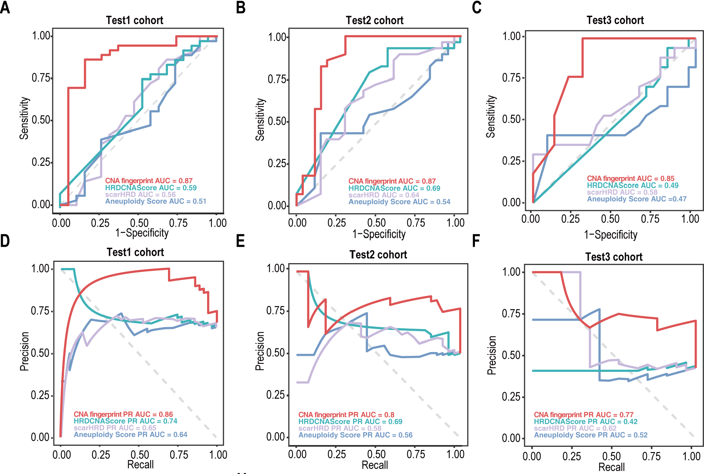

## Final Model Evaluation

The performance of CNA fingerprint on three independent test sets.

### AUC,PRAUC

Defining figure plotting functions.

```{r,eval=TRUE}
library(precrec)
library(dplyr)
library(ggplot2)
library(ggpubr)
library(pROC)

preform <- function(score,i){
  score <- score[which(!is.na(score[,i])),]
  score$lable <- factor(score$lable,levels = c(0,1))
  pre_obj1 <- mmdata(score[,i], score$lable,posclass = 1)
  pre_obj1 <- evalmod(pre_obj1)
  auc <- precrec::auc(pre_obj1)
  pre1_df <- fortify(pre_obj1)
  if(i=="Aneuploidy_score"){i="Aneuploidy Score"}
  pre1_df$Dataset <- i
  pre1_df$auc <- round(auc$aucs[1],2)
  pre1_df$prc <- round(auc$aucs[2],2)
  return(pre1_df)
}

jyplot <- function(list,type){
  num <- data.frame(matrix(ncol = 3, nrow = length(list)))
  for (i in 1:length(list)) {
    num[i,1] <- list[[i]]$Dataset[1]
    num[i,2] <- list[[i]]$auc[1]
    num[i,3] <- list[[i]]$prc[1]
  }
  #
  performance_df <- Reduce(rbind, list)
  cols <- c("CNAfingerprint" = "#ea5455",
            "HRDCNAScore" = "#3fbac2",
            "scarHRD" = "#cabbe9",
            "Aneuploidy Score"="#769fcd")
  if(type=="auc"){
    roc <- performance_df[performance_df$curvetype == "ROC",]
    p <- ggplot(roc, aes(x=x, y=y, group = Dataset)) +
      theme_bw() +
      geom_line(aes(color = Dataset),linewidth=1.2) +
      xlab("1-Specificity") +
      ylab("Sensitivity") +
      theme(plot.title = element_text(hjust = 0.5),
            panel.grid=element_blank(),
            # line = element_line(color = "black", linewidth = 1.5,
            #                     linetype = 1, lineend = "butt"),
            axis.text.x  =  element_text(size=14,color = "black"),
            axis.text.y = element_text(size=14,color = "black"),
            axis.line = element_line(colour="black"),
            legend.position = "none",
            title=element_text(size=14),
      ) +
      scale_color_manual(values =  cols)+
      guides(color=guide_legend(title="Dataset"))+
      annotate("segment", x = 0, y = 0,xend = 1, yend = 1,
               color = "gray", size = 0.5, linetype = "dashed")+
      annotate("text",x = .6, y = .26,size=3, colour="#ea5455",
               label=paste(num[1,1],"AUC =",num[1,2])) +
      annotate("text",x = .6, y = .19,size=3, colour="#3fbac2",
               label=paste(num[2,1],"AUC =",num[2,2]))+
      annotate("text",x = .6, y = .12,size=3, colour="#cabbe9",
               label=paste(num[3,1],"AUC =",num[3,2]))+
      annotate("text",x = .6, y = .05,size=3, colour="#769fcd",
               label=paste(num[4,1],"AUC =",num[4,2]))
    
  }else if(type=="prc"){
    
    prc <- performance_df[performance_df$curvetype == "PRC",]
    
    p <- ggplot(prc, aes(x=x, y=y, group = Dataset)) +
      theme_bw() +
      geom_line(aes(color = Dataset),linewidth=1)+
      xlab("Recall") +
      ylab("Precision") +
      theme(plot.title = element_text(hjust = 0.5),
            panel.grid=element_blank(),
            # line = element_line(color = "black", linewidth = 1.5,
            #                     linetype = 1, lineend = "butt"),
            axis.text.x  =  element_text(size=14,color = "black"),
            axis.text.y = element_text(size=14,color = "black"),
            axis.line = element_line(colour="black"),
            legend.position = "none",
            title=element_text(size=14),
            legend.text = element_text(size=14),
            legend.title = element_text(size = 14))+
      coord_cartesian(xlim = c(0,1), ylim = c(0,1))+
      scale_color_manual(values =  cols)+
      annotate("segment", x = 0, y = 1,xend = 1, yend = 0, 
               color = "gray", size = 0.5, linetype = "dashed")+
      annotate("text",x = .4, y = .26,size=3, colour="#ea5455",
               label=paste(num[1,1],"PR AUC =",num[1,3])) +
      annotate("text",x = .4, y = .19,size=3, colour="#3fbac2",
               label=paste(num[2,1],"PR AUC =",num[2,3]))+
      annotate("text",x = .4, y = .12,size=3, colour="#cabbe9",
               label=paste(num[3,1],"PR AUC =",num[3,3]))+
      annotate("text",x = .4, y = .05,size=3, colour="#769fcd",
               label=paste(num[4,1],"PR AUC =",num[4,3]))
  }
  
  return(p)
}

score_turn <- function(data,type){
  if(type == "soft"){
    #data$ploidy <- max(data$ploidy)-data$ploidy
    data$HRDCNAScore <- 1-data$HRDCNAScore
    data$scarHRD <- max(data$scarHRD)-data$scarHRD
    data$Aneuploidy_score <- (max(data$Aneuploidy_score)-data$Aneuploidy_score)/39
  }
  if(type== "hard"){
    data$CNAfingerprint <- ifelse(data$CNAfingerprint>0.58,1,0)
    #data$ploidy <- ifelse(data$ploidy>=4,0,1)
    data$HRDCNAScore <- ifelse(data$HRDCNAScore>0.2,0,1)
    data$scarHRD <- (data$scarHRD- min(data$scarHRD))/(max(data$scarHRD)-min(data$scarHRD))
    data$scarHRD <- 1-data$scarHRD
    scarcut <- quantile(data$scarHRD,probs=0.75)
    data$scarHRD <- ifelse(data$scarHRD > scarcut,1,0)
    #
    data$Aneuploidy_score <- data$Aneuploidy_score/39
    as_cut <- quantile(data$Aneuploidy_score,probs=0.75)
    data$Aneuploidy_score <- ifelse(data$Aneuploidy_score >as_cut,0,1)
    data$`Tumor site` <- ifelse(data$`Tumor site`== 'Right side',0,1)
  }
  return(data)
}


```

Take the example of calculating the RO AUC and PR AUC for Test1 cohort.

```{r, eval=TRUE,fig.width=8,fig.height=4}
data <- read.csv("../data/all_test.csv",check.names = F)

#
data <- data[which(data$batch=="Test1"),]

data_auc <- score_turn(data,"soft")

preform_list <- list()
for(i in c("CNAfingerprint","HRDCNAScore","scarHRD","Aneuploidy_score")){
  a <- preform(data_auc,i)
  preform_list <- c(preform_list, list(a))
}

#auc prc
library(patchwork)
p <- jyplot(preform_list,"auc")
p2 <- jyplot(preform_list,"prc")
p + p2

```

The ROAUC and PRAUC for all test cohorts.

```{r, echo=FALSE, out.width="100%", fig.align='center'}
library(knitr)

```

for no-oxaliplatin cohort,we also get the AUC.

```{r,eval=TRUE, out.width="100%",fig.align='center',fig.width=4,fig.height=4}
noOxa_cohort <- readRDS("../data/noOxa_cohort.rds")
data <- na.omit(noOxa_cohort)
data$lable <- ifelse(data$res=="PD",0,1)

plot.roc(
  data$lable,
  data$CNAfingerprint,
  col = "#3d84a8",
  percent = TRUE,
  lwd = 2.5,
  print.auc = TRUE,
  print.auc.cex = 0.7,
  print.auc.pattern = paste0("CNA fingerprint",": %.1f%%"),
  print.auc.y = 35
)

```


